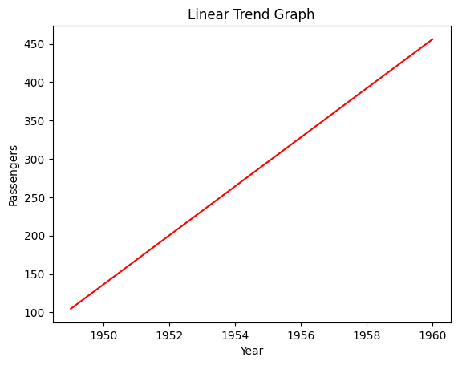
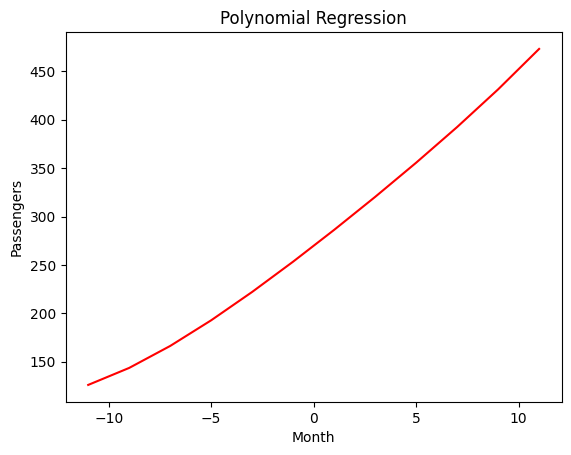

# Ex.No: 02 LINEAR AND POLYNOMIAL TREND ESTIMATION
Date:
### AIM:
To Implement Linear and Polynomial Trend Estiamtion Using Python.

### ALGORITHM:
Import necessary libraries (NumPy, Matplotlib)

Load the dataset

Calculate the linear trend values using least square method

Calculate the polynomial trend values using least square method

End the program
### Name : YUVARAJ.S
### Register Number : 212222240119
## PROGRAM:
### A - LINEAR TREND ESTIMATION
#### Trend equation using Linear Equation
```py
import pandas as pd
import numpy as np
import matplotlib.pyplot as plt

# Read the data from CSV
data = pd.read_csv("AirPassengers.csv")

# Create DataFrame
df = pd.DataFrame(data)

# Extracting months and passengers
months = np.arange(1, len(df) + 1)
passengers = df['#Passengers'].values

# Linear trend estimation
linear_coefficients = np.polyfit(months, passengers, 1)
linear_trend = np.poly1d(linear_coefficients)


# Plotting
plt.figure(figsize=(10, 6))

plt.scatter(months, passengers, color='green', label='Actual Data')
plt.plot(months, linear_trend(months), color='red', label='Linear Trend')

plt.title('Linear Trend Estimation')
plt.xlabel('Months')
plt.ylabel('#Passengers')
plt.legend()
plt.grid(True)
plt.show()

```

### B- POLYNOMIAL TREND ESTIMATION
#### Polynomial Trend EStimation 4th degree
```py
## Polynomial TRend EStimation 4th degree

import pandas as pd
import numpy as np
import matplotlib.pyplot as plt

# Read the data from CSV
data = pd.read_csv("AirPassengers.csv")

# Create DataFrame
df = pd.DataFrame(data)

# Extracting months and passengers
months = np.arange(1, len(df) + 1)
passengers = df['#Passengers'].values


# Polynomial trend estimation (let's say degree=2 for quadratic)
polynomial_coefficients = np.polyfit(months, passengers, 2)
polynomial_trend = np.poly1d(polynomial_coefficients)

# Plotting
plt.figure(figsize=(10, 6))
plt.scatter(months, passengers, color='black', label='Actual Data')
plt.plot(months, polynomial_trend(months), color='green' ,label='Polynomial Trend')

plt.title('Polynomial Trend Estimation')
plt.xlabel('Months')
plt.ylabel('#Passengers')
plt.legend()
plt.grid(True)
plt.show()
```
### OUTPUT

A - LINEAR TREND ESTIMATION



B- POLYNOMIAL TREND ESTIMATION



### RESULT:
Thus the python program for linear and Polynomial Trend Estiamtion has been executed successfully.
